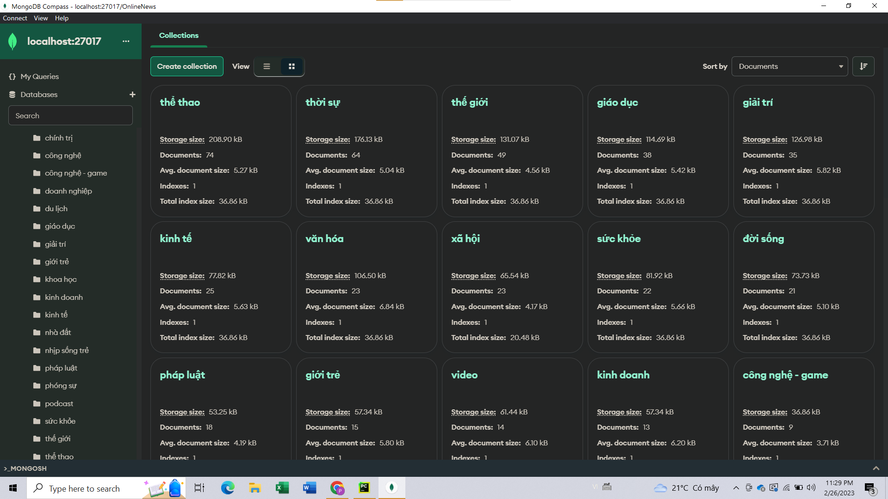
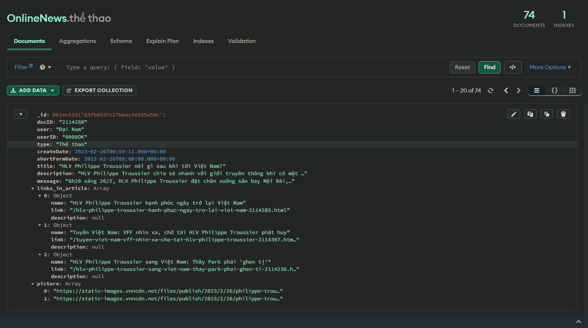

# Chủ đề: Crawl dữ liệu báo điện tử
## I. Mở đầu
### 1. Giới thiệu đề tài

- Báo chí từ lâu luôn là một kênh thông tin quan trọng phản ánh mọi
vấn đề, sự việc trong xã hội. Và với sự phát triển của Internet và các thiết bị di động hiện nay,
báo điện tử đã trở thành một loại phương tiện truyền thông phổ biến, 
cho phép người dùng có thể truy cập và đọc các tin tức, thông tin
từ mọi nơi trên thế giới.
- Sở hữu nhiều lợi thế so với báo giấy truyền thống như: dễ dàng truy cập, 
nội dung đa dạng, cập nhật nhanh chóng và tính tương tác cao, báo điện tử phát triển khá nhanh
chóng và thay đổi thói quen đọc báo của không ít người đọc. Tuy nhiên, báo điện
tử cũng tồn tại nhiều mặt trái khi những nội dung không lành mạnh, độc hại có thể được
lan truyền nhanh chóng.
- Một số trang báo điện tử lớn tại Việt Nam có thể kể đến như: Vnexpress, 24h, Dân trí,
Zingnews, Báo thanh niên, v.v...
- Việc thu thập dữ liệu từ các báo điện tử có tác dụng quan trọng trong việc phân tích, đánh giá
và dự báo các xu hướng của thị trường, kinh tế và chính trị, xã hội. Cùng với đó
cũng có thể được sử dụng để phát hiện và theo dõi các thông tin sai lệch, tin tức giả và các nội 
dung độc hại khác.

### 2. Mục tiêu dự án

- Mục tiêu dự án là xây dựng chương trình có khả năng tự động thu thập dữ liệu
từ các trang báo điện tử lớn ở Việt Nam và thực hiện lưu trữ vào Database.
- Chương trình cần đáp ứng các chức năng sau:
  + Lấy về được đầy đủ các dữ liệu được chỉ định
  + Tự động thu thập dữ liệu hằng ngày
  + Mỗi lần chạy chỉ lưu trữ các bài báo xuất bản trong ngày
  + Kiểm tra và loại bỏ các bài báo có nội dung trùng lặp
  + Lưu trữ dữ liệu vào Database
- Danh sách các trang báo mà dự án thực hiện thu thập dữ liệu:
  + 24h
  + Báo Chính phủ
  + Thời báo tài chính Việt Nam
  + Báo Công an nhân dân
  + Báo Dân trí
  + Báo Kiểm sát
  + Báo Lao động
  + Báo Người lao động
  + Báo Nhân dân
  + Báo Thanh niên
  + Báo Tuổi trẻ
  + Báo Vietnamnet
  + Báo Vnexpress
  + Báo Vov
  + Báo Vtv
  + Zingnews

### 3. Công nghệ sử dụng

- Python: Ngôn ngữ lập trình chính của dự án
- Scrapy: framework cho phép thu thập dữ liệu trên web và bóc tách dữ liệu
- XPath: ngôn ngữ truy vấn sử dụng để truy xuất và lấy dữ liệu từ các tài liệu XML hoặc HTML
- MongoDB: hệ quản trị cơ sở dữ liệu NoSQL, sử dụng để lưu trữ dữ liệu thu thập được.

## II. Thực hiện

### 1. Lập trình Spiders

- Spiders trong Scrapy là các lớp Python thực hiện nhiệm vụ truy cập, thu thập
và bóc tách dữ liệu từ các trang Web. 
- Mỗi trang báo của dự án sẽ được thu thập bởi một spider. Các spiders sẽ thực hiện
thu thập dữ liệu theo chiến lược bắt đầu từ trang chủ, sử dụng Xpath để lấy đường
link của các thư mục con và các bài báo, đi theo các đường link đó để bóc tách và lấy
về những dữ liệu được chỉ định.
- Với mỗi bài báo, các spiders có nhiệm vụ lấy những dữ liệu sau:
  - docID: Id của bài viết
  - user: Tên tác giả
  - userID: Id tác giả
  - type: Chủ đề của bài báo
  - createDate: Ngày xuất bản bài báo
  - shortFormDate: Dạng rút gọn của createDate
  - title: Tiêu đề bài báo
  - description: Mô tả của bài báo
  - message: Nội dung bài báo
  - links_in_article: Thông tin các liên kết được đính kèm trong bài báo
  - picture: Url các ảnh trong bài báo

- Mô hình cơ bản của một spider sẽ như sau:

    ```python
    import scrapy
  
    class News_spider(scrapy.Spider):
        name = 'spider_name'
        allowed_domains = ['domain_1', 'domain_2', ...]
        start_urls = ['home_page_link']
  
        def parse(self, response):
            topic_links = response.xpath('xpath_expression').getall()
                # follow link for link in topic_links
            article_links = response.xpath('xpath_expression').getall()
                # follow link for link in article_links
        ...
        ...
        def parse_article(self, response):
            news = newsItem()
            news['docID'] = response.xpath('xpath_expression').get()
            news['user'] = response.xpath('xpath_expression').get()
            ...
            news['picture'] = response.xpath('xpath_expression').get()
            yield news
    ```
  
### 2. Tạo pipelines để xử lý và lưu trữ dữ liệu

- Dữ liệu sau khi được lấy về từ các trang Web khác nhau thường có thể không đồng nhất,
không đúng định dạng mong muốn hoặc dư thừa các dữ liệu lặp lại, không cần thiết.
- Vì vậy, các dữ liệu lấy về bởi spiders sẽ được đưa qua pipelines để xử lý và thực hiện
lưu trữ.
- Trong dự án này, pipelines sẽ thực hiện các thao tác sau:
    
    |STT|Tên|Chức năng|
    |:---|:---|:---------|
    |1|CreateDateToDatetime|Chuyển đổi ngày xuất bản từ kiểu string sang datetime|
    |2|ShortFormDateToDatetime|Chuyển đổi ngày xuất bản từ kiểu string sang datetime|
    |3|CheckTimePipeline|Loại bỏ các bài báo xuất bản không cùng ngày thu thập|
    |4|ConcatenateMessagePipeline|Chuyển nội dung từ list về string|
    |5|SimilarityPipeline|Loại bỏ các bài báo có nội dung trùng lặp|
    |6|StoreToMongoPipeline|Lưu trữ dữ liệu vào MongoDB|

### 2.1. Chuyển đổi thời gian từ kiểu string sang datetime

- Các dữ liệu thời gian khi lấy về ở dạng string nên cần chuyển sang kiểu dữ liệu
datetime để thuận tiện cho việc so sánh.
  ```python
  from datetime import datetime
  
  class CreateDateToDatetime:
      def process_item(self, item, spider):
          adapter = ItemAdapter(item)
          dateString = item.get('createDate')
          if dateString:
              format = '%Y-%m-%dT%H:%M:%S.%f%z'
              Datetime = datetime.strptime(dateString, format)
              adapter['createDate'] = Datetime
          else:
              raise DropItem("Can not get the create date")
          return item
  
  
  class ShortFormDateToDatetime:
      def process_item(self, item, spider):
          adapter = ItemAdapter(item)
          dateString = adapter.get('shortFormDate')
          format = '%Y-%m-%d'
          Datetime = datetime.strptime(dateString, format)
          adapter['shortFormDate'] = Datetime
          return item      
  ```
### 2.2. Loại bỏ các bài báo xuất bản không cùng ngày thu thập

- Các spiders sẽ thực hiện thu thập dữ liệu hằng ngày vì thế cần loại
bỏ các bài báo được xuất bản vào các ngày trước đó để tránh thu thập
lại các dữ liệu cũ.

  ```python
  class CheckTimePipeline:
      def process_item(self, item, spider):
          adapter = ItemAdapter(item)
          today = datetime.now()
          if adapter.get('shortFormDate').date() != today.date():
              raise DropItem("This article is not published today")
          return item
  ```
### 2.3. Chuyển nội dung về string

- Nội dung của các bài báo khi mới lấy về ở dạng một danh sách chứa từng đoạn
nhỏ của nó. `ConcatenateMessagePipeline` sẽ thực hiện chuyển đổi nội dung
về một chuỗi duy nhất và loại bỏ các ký tự không cần thiết.

  ```python
  class ConcatenateMessagePipeline:
      def process_item(self, item, spider):
          adapter = ItemAdapter(item)
          message = ''
          for para in adapter.get('message'):
              message = message + para
          adapter['message'] = message.replace('\n', '').replace('\xa0', '')
          return item
  ```
### 2.4. Kiểm tra và loại bỏ các bài báo trùng lặp

- Nhiều trường hợp một bài báo có thể được reup trên nhiều trang báo khác
nhau. Các bài báo trước khi được lưu trữ vào Database sẽ được kiểm tra xem
có nội dung trùng lặp với các bài báo trước đó hay không.
- Tuy nhiên việc so sánh với tất cả dữ liệu trong Database sẽ tốn kém rất
nhiều thời gian khi lượng dữ liệu ngày càng lớn. Vì vậy, mỗi lần thực hiện
thu thập dữ liệu, chúng ta sẽ sử dụng một tập hợp lưu trữ nội dung của các bài
báo trong lần thu thập đó và chỉ so sánh các nội dung đó với nhau.

  ```python
  from sklearn.feature_extraction.text import TfidfVectorizer 
  from sklearn.metrics.pairwise import cosine_similarity
  
  class SimilarityPipeline:
      def __init__(self):
          self.articles = set()

      def _is_similar(self, article1, article2):
          article1 = article1.lower()
          article2 = article2.lower()
  
          # Create a TfidfVectorizer object and fit it to the articles
          vectorizer = TfidfVectorizer()
          vectors = vectorizer.fit_transform([article1, article2])

          # Calculate the cosine similarity between the vectors
          similarity = cosine_similarity(vectors[0], vectors[1])[0][0]

          # Return True if the similarity is greater than a threshold value, False otherwise
          return similarity > 0.8

      def process_item(self, item, spider):
          adapter = ItemAdapter(item)
          message = adapter.get('message')
          if len(message) < 100:
              raise DropItem("This article is to short")
          # Check if the current article is similar to any of the previously seen articles
          for article in self.articles:
              if self._is_similar(message, article):
                  # If the article is similar, drop the item
                  raise DropItem("This message has already scraped")

          # If the article is not similar to any of the previously seen articles, add it to the set
          self.articles.add(message)
          return item
  ```
- Tuy nhiên, theo mặc định mỗi spider sẽ chạy trong một tiến trình riêng lẻ, tập articles của mỗi
trang báo đều bắt đầu từ tập trống và SimilarityPipeline chỉ có thể so sánh các
bài báo trong cùng một trang. Để có thể so sánh tất cả các bài báo của các trang khác
nhau, chúng ta cần sử dụng tiện ích `scrapy.crawler.CrawlerProcess`. Chúng ta sẽ thêm
một file `run.py` và cài đặt như sau:

  ```python
  from scrapy.crawler import CrawlerProcess
  from scrapy.utils.project import get_project_settings

  spider_names = ['vtv', 'vov', 'vnexpress', 'vietnamnet', 'tuoitre', 'thanhnien',
                  'nhandan', 'nld', 'laodong', 'kiemsat', 'dantri', 'cand', '24h',
                  'thoibaotaichinh', 'baochinhphu', 'zingnews']

  if __name__ == "__main__":
      process = CrawlerProcess(get_project_settings())
      for spider_name in spider_names:
          process.crawl(spider_name)
      process.start()
  ```
  Như vậy, tất cả các spiders sẽ chạy trong cùng một tiến trình, tập articles
  sẽ thực hiện lưu trữ nội dung của tất cả các trang báo và so sánh chúng với
  nhau.

### 2.5. Lưu trữ vào Database

- Sau khi đã qua các bước xử lý trên, dữ liệu sẽ được lưu trữ vào `MongoDB`. Dữ liệu 
của từng bài báo sẽ được lưu trữ vào collection có tên trùng với chủ đề của bài báo đó.

  ```python
  import pymongo
  
  class StoreToMongoPipeline:
      def __init__(self):
          self.conn = pymongo.MongoClient('localhost', 27017)
          self.db = self.conn['OnlineNews']

      def process_item(self, item, spider):
          adapter = ItemAdapter(item)
          collection_name = adapter.get('type').lower()
          collection = self.db[collection_name]
          collection.insert_one(ItemAdapter(item).asdict())
          return item
  ```
  
  

### 3. Lập lịch spiders và các cài đặt bổ sung

### 3.1. Lập lịch spiders
### 3.2. Một số cài đặt bổ sung
- Để tăng hiệu suất thu thập dữ liệu, ta có thể chỉnh sửa hoặc thêm vào
  vào file `settings.py` một số cài đặt sau:
  + Tăng số requests được thự hiện song son từ 16 (mặc định) lên 25:
    ```python
    CONCURRENT_REQUESTS = 25
    ```
  + Thay đổi xoay vòng USER_AGENTS và PROXIES để tránh bị chặn khi số
    requests tăng lên:
    ```python
    PROXY_POOL_ENABLED = True

    DOWNLOADER_MIDDLEWARES = {
        # Rotate USER_AGENT
        'scrapy.downloadermiddlewares.useragent.UserAgentMiddleware': None,
        'scrapy_user_agents.middlewares.RandomUserAgentMiddleware': 400,
        # ROTATE PROXIES
        'scrapy_proxy_pool.middlewares.ProxyPoolMiddleware': 610,
        'scrapy_proxy_pool.middlewares.BanDetectionMiddleware': 620,
    }
    ```
  + Khi chạy nhiều spiders trong cùng một tiến trình, số lượng requests sẽ trở lên
  rất lớn dẫn tới hệ thống mạng có thể quá tải và xảy ra các lỗi Connection Lost hay
  Timeout dẫn tới mất dữ liệu. Chúng ta có thể tăng các giá trị `DOWNLOAD_TIMEOUT` và
  `DOWNLOAD_DELAY` lên để giảm thiểu các trường hợp này.
  
    ```python
    DOWNLOAD_TIMEOUT = 300  # Set the timeout to 300 seconds (default = 180)
    DOWNLOAD_DELAY = 0.5  # Set the delay between requests to 0.5 seconds (default = 0)
    ```
## III. Tổng kết
### 1. Quá trình thực hiện
- Tiến độ thực hiện dự án qua các buổi báo cáo:
  - Buổi 1: Tìm hiểu về scrapy và Xpath.
  - Buổi 2: Cài đặt spiders cho 2 trang báo VnExpress và Vietnamnet.
  - Buổi 3: Không báo cáo
  - Buổi 4: Cài đặt spiders cho các trang báo: Dân trí, Báo Thanh niên, Báo lao động, v.v...
    (13 trang báo) và cài đặt pipelines xử lý và lưu trữ dữ liệu (chưa
    cài đặt được model kiểm tra trùng lặp nội dung).
  - Buổi 5: Sửa lại một số lỗi trong các spiders, cài đặt thêm cho 3 trang báo:
    24h, Báo tuổi trẻ, Zingnews.
  - Buổi 6: Cài đặt model kiểm tra trùng lặp vào pipelines, chỉnh sửa và thực hiện một số cài đặt bổ
    sung để tăng hiệu suất thu thập dữ liệu.

### 2. Kết quả đạt được
- Cơ bản đã thực hiện được hầu hết các chức năng đề ra từ ban đầu
- Mỗi lần chạy có thể thu thập và lưu trữ được khoảng trung bình 70-120 bài báo mỗi trang.
- Các dữ liệu thu thập về tương đối đầy đủ và nhất quán

### 3. Các phần chưa làm được
- Chưa lập lịch được cho chương trình chạy hằng ngày trên server

   
