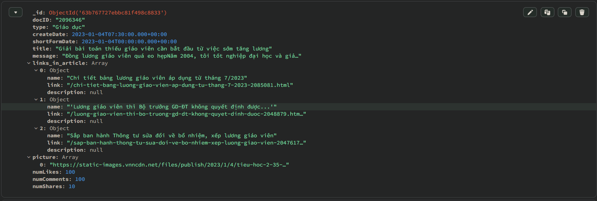
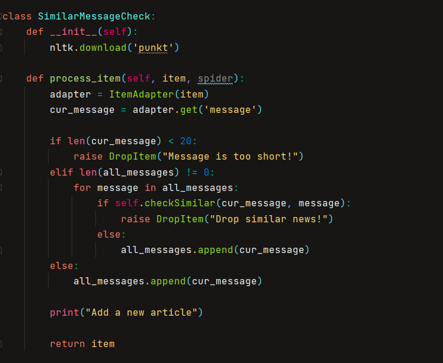
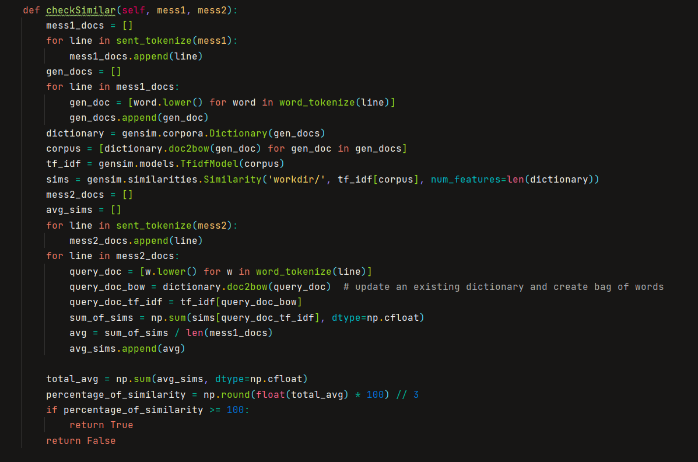

# Chủ đề: Crawl dữ liệu báo điện tử

### I. Đặt vấn đề

* Báo chí từ lâu luôn là một phương tiện quan trọng trong việc cung cấp thông tin, điều hướng nhận thức của
xã hội. Với sự phát triển của công nghệ số, các tờ báo điện tử đang ngày càng phát triển và
ảnh hưởng tới thói quen đọc báo của tất cả mọi người bởi sự dễ dàng và nhanh chóng trong việc tiếp cận.
* Việc crawl  dữ liệu từ các trang báo điện tử sẽ cho phép chúng ta có thể phân tích xu hướng, các vấn đề được quan tâm 
trong xã hội và sự ảnh hưởng của chúng đối với mọi người.
1. Các tờ báo để crawl trong project
- Báo 24h
- Báo Chính phủ
- Báo mới
- Báo Tài chính
- Báo Công an nhân dân
- Báo Dân trí
- Báo Kiểm sát
- Báo Lao động
- Báo Người lao động
- Báo Nhân dân
- Báo Thanh niên
- Báo Tuổi trẻ
- Báo Vietnamnet
- Báo Vnexpress
- Báo Vov
- Báo VtvNews
- Báo Zingnews
2. Mục tiêu
- Cài đặt một chương trình tự động lấy dữ liệu từ các bài báo điện tử hằng ngày

### II. Thực hiện
1. Chiến lược thực hiện
- Đối với mỗi tờ báo điện tử, ta sẽ bắt đầu từ đường link trang chủ của tờ báo đó.
Tại mỗi trang, nếu trang đó không phải bài báo cụ thể, ta sẽ thực hiện 2 công việc: thứ nhất là lấy các đường link và truy cập vào các thự mục con của trang đó, 
thứ hai lấy các đường link và truy cập vào các bài báo cụ thể xuất hiện ở trang đó. Nếu trang đang crawl là
bài báo cụ thể, ta bóc tách bài báo để lấy các trường mong muốn và lưu trữ vào Database.

2. Cấu trúc lưu trữ

Dữ liệu từ các bài báo sẽ được bóc tách và lưu trữ ở dạng json theo cấu trúc sau:
- docID: Id của bài viết
- user: Tên tác giả
- userID: Id tác giả
- type: Chủ đề của bài báo
- createDate: Ngày tạo bài báo
- shortFormDate: dạng rút gọn của createDate
- title: Tiêu đề bài báo
- message: Nội dung bài báo
- links_in_article: Thông tin các đường link được đính kèm trong bài báo
- numLikes: Số lượng like
- numComments: Số lượng comments
- numShares: Số lượt shares

3. Kiểm tra trùng lặp

4. Các vấn đề chưa giải quyết được
- Chưa tích hợp kiểm tra trùng lặp nội dung. Hai bài báo giống nhau vẫn cùng được crrawl về.
- Chưa lấy được số lượng Like, Commnet, Share 
- Chưa lập lịch được cho các spider tự động crawl hằng ngày
- Các tờ báo có cấu trúc và cách phân mục khác nhau gây khó khăn trong việc phân tích, trong cùng một tờ báo
nhiều bài báo cũng có format khác nhau, khó để cài đặt một thuật toán chung cho việc bóc tách dữ liệu 